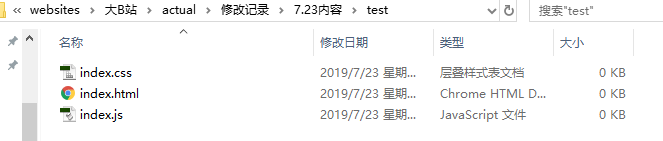
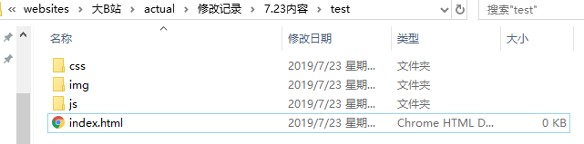
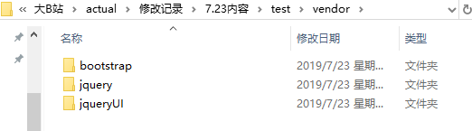
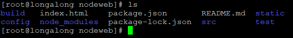
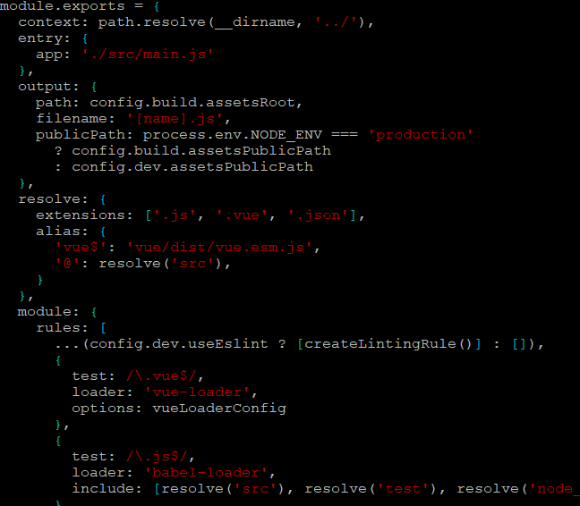
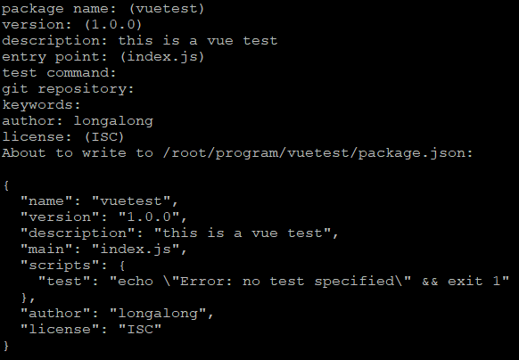
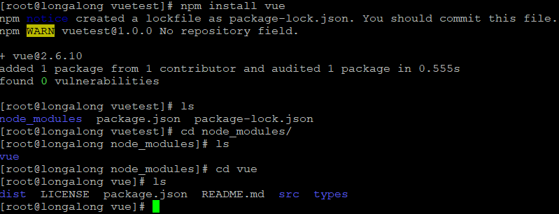
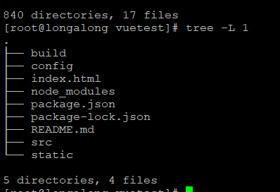
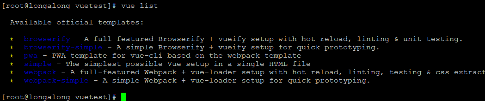

#### 学习脚手架的搭建

##### 引言

* 由于自己是初学前端，而且是自学派，一开始就是看 W3Cshool 上面的基础教程，所以从一开始学习前端就是野生路子，根本不知道在做一个项目的时候什么样的文件结构是合理的，最早就是全部堆在一个文件夹里，大概就像这个亚子：

* 逐渐学习和实践的过程中，发现各种图片很多，还有css、js、html文件也开始多起来了，全放一个文件夹就特别乱，经常找不到，就大概理解到了应该做文件结构管理了，然后就建立了3个文件夹： js、 css、 img ，把html文件放到根目录下。就成了这个样子：

* 再稍微往后，觉得光知道一点点html、css和完全没入门的js是不够的！！要学习各种框架！！所以就开始接触jquery和bootstrap，虽然这些库都是可以用cdn引入的，那样就不用下载文件了，但作为初学的我，还是老老实实地下载了下来，然后我在想啊，这些文件我该怎么放呢？ jquery只有一个文件，把它放在js文件夹下倒还行，但bootstrap既有js又有css啊，分开放虽然也可以，但总感觉乖乖的，以后要是库文件多一些，岂不是要把自己搞昏？ 然后就看到有人把库文件都放在一个叫做vendor的文件夹里，大概就想这个样子: 

* 之前学习jquery和bootstrap的时候，觉得框架可能都长这样，一个js或者一个css+js的形式，要用各种框架就跑去官网下载下来，然后放到自己的文件夹下面，在index.html里link一下css，script:src 一下js，就可以在写页面的时候用这些框架预定义的一些方法和属性了。 ……我知道我天真了……
后来看到招聘信息里都要求会vue、react、angular这些真正的前端框架（之前的JQuery和bootstrap只能算库），所以就开始试着用vue（别问为什么选vue不选另外两个，没有为啥，因为它只有三个字母，简单  滑稽一下）。 然后就要开始搭建vue的环境啊，这个时候就开始疯了…… ，跟之前的完全不一样啊！！！ 我之前真的学的是前端吗？？ 是的，从vue开始就要用node了，还有npm，还有webpack……， node还好，作为一个js的运行环境，目前只需要大致知道它是干啥的就行（解释器，用来解释并执行js的）， npm是个啥子鬼？ 包管理是个啥？ 不都是自己去官网下载，然后link一下吗？？？ webpack又是啥子gui？？？ package.json是个啥？ webpack.conf.js是个啥？ 我怎么知道里面要写些什么啊？？？？ 好的，疯完了就继续学习叭…… 从这里开始，后面的内容和前面的关系就不大了，前面学的那些html、css、jquery、bootstrap基本上就成了个弟弟，一个新的世界摆在眼前了……
随意感受一下：

##### 开始使用脚手架工具

* 从vue开始，接触到了node、 npm、 webpack、 各种loader、 jslint 等等这些东西，虽然看着一堆完全看不懂的代码脑壳有点疼，但这么多年的学习经验告诉我，我只有认识了所有这些概念之后，才能学会使用这些东西，所以就想硬着头皮去啃一啃，心想多花点时间，总会有效果的叭……没事的，看不懂只是暂时的……再多看半分钟………… emmmm……， 太痛苦了…… 原来这才是编程的难度吧…… 我可能果然不适合学编程…… 其实做回去做财务也还行…… 好吧，心理戏太足了，静下来想想，这完全不应该啊，按理说编程应该是一件让人快乐的事情的呀，而且某乎上一堆的人都说前端简单，说vue很容易学等等，不应该学得这么辛苦才对的，因该是我的方法有问题，不如先跟着vue的官方文档走一下小案例吧……

* 在vue官方文档中，首先就是搭建环境，先 `npm init` 创建一个项目信息文件，这是node项目开发的标准第一步了，说了这个项目的名称、介绍这些基本信息，结果就是产生一个项目的信息配置文件 package.json ，过程大概就是这个样子：

初始化了项目信息之后，就是安装需要的一些工具（也就是依赖的包），学习vue的时候，首先就是安装一个vue `npm install vue` 就ok了，然后就产生了一个node_modoles的文件夹，里面就放着刚刚安装的vue。 

按之前学习bootstrap和jquery的经验的话，我就直接把vue的一些文件拷贝出来就可以开始编程了，但是……我懵了，文件这个多，究竟该拷哪个或哪些文件？？ 终于认识到之前的经验是有误的，不要再执着于如何拷文件过来了，还是跟着教程再走走吧……
感受一下vue的文件目录：

继续安装 vue-cli (vue command line interface)`npm install -g vue-cli`,也就是vue命令行界面，然后用vue的命令 `vue list`查看有些什么模板可以用 

是的，这里主角终于出来了，官方模板啊！！！ 也就是用vue搭建项目的话，vue的官方提供了一些文件结构，还把一些基础的配置都给配置好啦！！ 不用自己配webpack啊！爽歪歪！！ 之前被虐的惨惨的，其中就有完全看不懂webpack配置文件的痛苦，结果，我几乎可以不用懂怎么配置webpack！！
然后我们用 `vue-init webpack` 就可以生成一个可以用webpack打包和调试的文件结构： 

然后就可以进行vue的组件编写了！！

* 这里 我们用到了 vue 官方提供的脚手架工具vue-cli， 用来生成特定的文件和结构和配置。

* 那么我就再想了呀，我们不能都使用 vue 提供的那几个简单的模板叭？ 虽然对于我们初学来说肯定是够搞一阵了，但是实际工作中就这么几个模板，就太不合理了，所以又查了一下， 找到了一些其他的。 一个是yeoman的模板，一个是cooking的模板。
* 叫模板不如叫模板库，实际上，vue-cli、 cooking-cli、 yeoman都是维护这一些由开发者提供的模板的库的库，可以通过这些脚手架的工具生成多种类型的文档模板。 不仅可以在初始时添加创建模板，还可以在过程中添加plugin `vue use element` 。
* 这些脚手架工具，对工程创建来说无疑是极大地提高效率啊，妥妥降低了前端程序员的开发难度。

##### 我的想法

* 这个发展趋势其实是一定肯定以及注定的，大众的项目都是有极大的相似的地方，据此提炼一些模板和操作上的逻辑，自然而然就会有这类工具的产生， 一段时间前，我在做一些练习的项目的时候，对创建文件的方式就不大满意，当时就在考虑做一个简单的工具，用来生成一些常用的简单模板，最基础的就是站在原来学习html、css的时候的角度（多页面），希望能够用简单的命令或操作快速生成模板文件，例如生成html、生成css、生成js文件，而这些文件里可以包含一些可选择的组件，我们在用命令创建文件时，可以交互选择或者直接用参数传递，或者提前设计好架构，直接用json配置文件来生成需要的文件。 连我这样一个刚开始做的人都在想这种事了，之前的前辈和大触们，肯定已经有最佳实践并进行封装的了。 
* 我目前学习前端的知识，还只是入门而已，因此需要先大量接触前端的各种库、各种框架，要先拓展自己的眼界，先跟上前端发展的前沿，至少知道有哪些工具，可以做写什么事 的基础上，再去深入一些细节的技术，这才是以应用为导向同时兼顾技术沉淀的学习思路。
* 这些工具目前提供的都是一些需要使用库的工程式前端开发的项目，其实我在理解前端自动化和工程化上，还基本没有入门，仅仅是知道可以用loader进行预处理，可以用webpack等进行依赖打包，可以用require或import以及export进行模块化开发，可以用e2e等进行单元测试，可以用webpack-dev-server等进行测试…… 但还无法真正分清楚各个部分应该怎么做？（自然，我需要继续深入学习） 就目前我写的项目实践来看，我做的更多的还是“传统的多页面静态网站开发”，写的最多的还是不同的html页面，不同的css文件，不同的js文件，那么，也就意味着我的生成模板文件的需求跟这些脚手架提供的功能有一定出入，所以，我可以在windows环境下写一些脚本，用来生成需要的文件，做一个个人定制版的简易脚手架工具。
